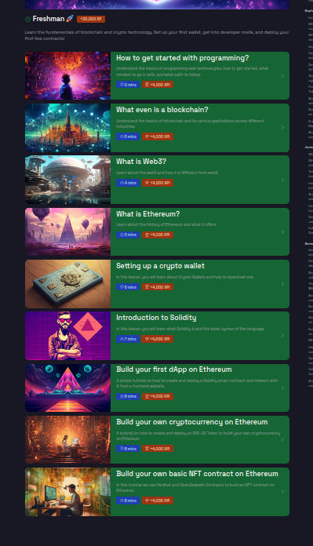
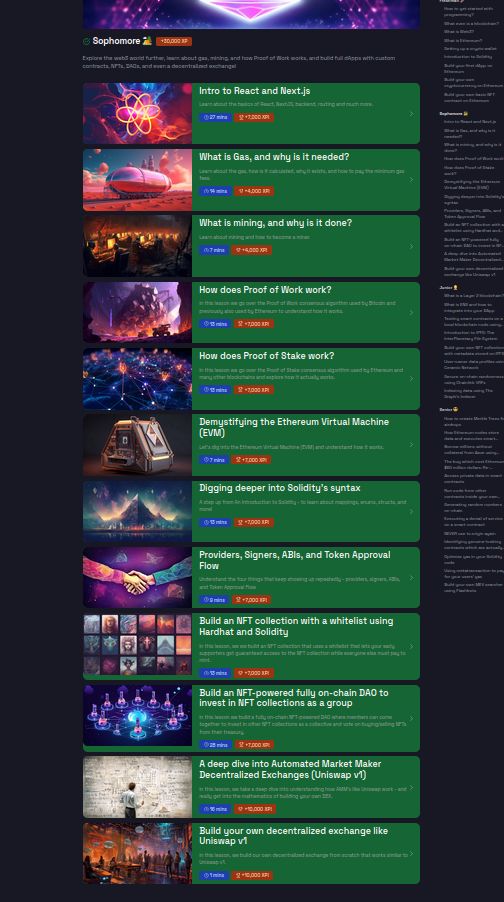
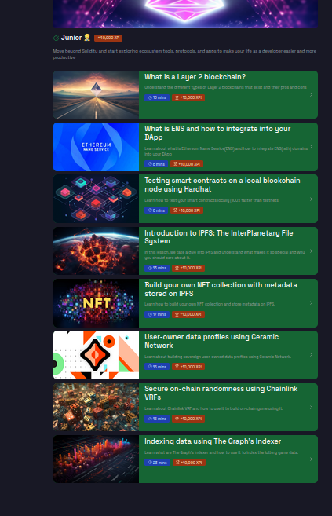
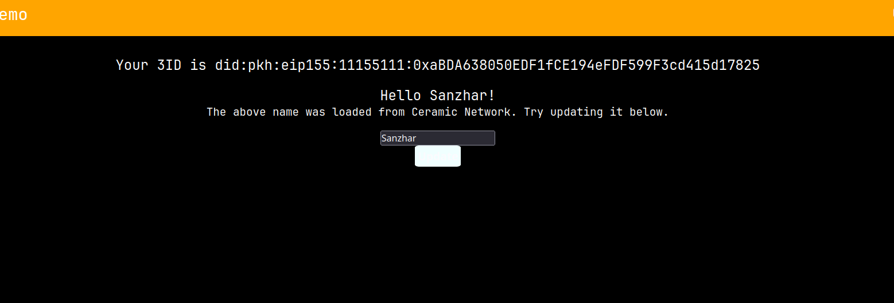

# REPORT

## Freshman

Progress:

Report:

1. Start w/ Programming - nothing to report

2. What even is a blockchain?
    1. Who created blockchain.
    2. What is a blockchain.
    3. Genesis block, miners etc.

* Other lessons either have nothing to report or I didn't save results of practices.

## Sophomore

Progress:

Report:

1. Intro to React and Next.js
    1. React(JSX, React Components, Hooks, etc.)
    2. Next.js(Routing, Writing APIs.)

2. What is Gas, and why is it needed?
    1. Pre-London Upgrade, Post-London Upgrade.
    2. Gas calculation. ()
    3. Gas limits for blocks, txns
    4. Gas cost and price concepts.

3. What is mining, and why is it done?
    1. Why miners exist.
    2. What is mining.
    3. What consensus mechanism does.

4. How does Proof of Work work?

    1. What is consensus and what is consensus mechanism.
    2. Proof of Work.
    3. What is sybil attack and sybil attack resistance.

5. How does Proof of Stake work?

    1. Proof of Stake.
    2. Validators and Validators vs Miners.
    3. Why Proof of Stake over Proof of Work.

6. Demystifying the Ethereum Virtual Machine(EVM)
    1. EVM as a Distributed State Machine
    2. EVM instructions.

7. Digging into Solidity's syntax
    1. Structs, enums, mapping, inheritance.
    2. Pure/View functions, modifiers and constructors.
    3. Transfer and Receive ETH.
    4. libraries, importing contracts

8. Providers, Signers, ABIs and Token Approval Flow
    1. As expected Providers, Signers, ABIs and Token Approval.

9. Build an NFT collection with a whitelist using Hardhat and Solidity 

    1. CryptoDevs NFT addr:  0x99131bB3F803d70ad6bddE4EB745cC406df9fdEE
    2. WhiteList addr: 0xfA4DF9E8fC45E0C8f219eB7CbDa64fDccD95F124

10. Build an NFT-powered fully on-chain DAO to invest in NFT collections as a group

    1. CryptoDevsNFT: 0x67c3fC3882Bbb2560b4215fd9320A34747a81458
    2. FakeNFTMarketplace: 0x221fc0b44b3c2449c6A195067b962C064507df4d
    3. CryptoDevsDAO: 0xdDD6aCa9Bf3daB6d97A81Eb53a191ed8958BC679

11. A deep dive into Automated Market Maker Decentralized Exchanges (Uniswap v1)
    1. What's the problem with Centralized Exchanges.
    2. Automated Market Makers concept.
    3. Uniswap v1.

12. Build your own decentralized exchange like Uniswap v1

    1. Token: https://sepolia.etherscan.io/address/0x4B8d002802629A4dbB61D02ce8cA615CC80C65c1#code
    2. Exchange: https://sepolia.etherscan.io/address/0x56146b6e93f9Db2EB67078f7fB4476869E7C7643#code

## Junior

Progress:

Report:

1. What is a Layer 2 blockchain?
    1. Main scaling strategies (State, side channels, optimistic rollups, etc.)
    2. Data availability
    3. L2 blockchain

2. What is ENS and how to integrate into your DApp
    1. Ethereum Name Service.
    2. Actual integration into an app
    3. Couldn't integrate though, didn't have Goerli coins.

3. Testing smart contracts on a local blockchain node using Hardhat
    1. Hardhat npm module or Remix
    2. Why testing on local node is faster.

4. Introduction to IPFS: The InterPlanetary File System
    1. InterPlanetary File System
    2. Location/Content based addressing.

5. Build your own NFT collection with metadata stored on IPFS
    1. Couln't implement cause mumbai network didn't respond

6. User-owner data profiles using Ceramic Network
    1. Implemented

    

7. Secure on-chain randomness using Chainlink VRFs

    1. Couldn't implement cause mumbai network didn't respond

8. Indexing data using The Graph's Indexer
    2. Didn't solve after seeing that in this tutorial mumbai is used, though completed reading.

## Senior

Progress:

Report:

1. How to create Merkle Trees for airdrops

    1. Merkle Tree concept.
    2. Benefits and use cases (general, blockchain or smart contracts).
    3. Verifying presense of leaf.

2. How Ethereum nodes store data and executes smart contracts
    1. World State.
    2. Txns, Accounts, Messages, etc.
    3. In memory: stack, gas in runtime.

3. Borrow millions without collateral from Aave using Flash Loans
    1. Flash loans concept.
    2. Application of flash loans.
    3. coding smart contract and hardhat test

4. The bug which cost Ethereum $60 million dollars: Re-entrancy

    1. Backstory
    2. Re-entrancy.
    3. Coding smart contract and hardhat test.

5. Access private data in smart contracts
    
    1. I think that at some point I just gave up on practice task of this one.

6. Run code from other contracts inside your own using delegatecall

    1. Function representation in Ethereum
    2. Calling using delegatecall
    3. Implementing practice task from lesson (contract and hardhat test)
    4. Learning prevention of delegatecall attacks

7. Generating random numbers on-chain 

    1. Problem of generating something random in fully determinated system.
    2. Building a game that generates random nums
    3. Here I failed cause I accidently created test in scripts, lol.

8. Executing a denial of service on a smart contract
    1. (DOS) Denial of service
    2. Prevention of DOS
    3. Hardhat test DOS

9. NEVER use tx.origin again
    1. Difference between tx.origin and msg.sender
    2. Hardhat test
    3. Prevention (just use msg.sender)

10. Identifying genuine-looking contracts which are actually malicious
    1. Not so clear for me tbh
    2. Though implemented hardhat test and solidity contracts.

11. Optimize gas in your Solidity code
    1. Variable packing
    2. Use mem copies instead of directly manipulating state stored in blockchain
    3. modifiers, libraries.
    4. public / external and internal.

12. Using metatransaction to pay for your users' gas
    1. Digital Signatures (usage, ethereum, ECDSA)
    2. Metatxns
    3. Implement practice task and code hardhat test

13. Build your own MEV searcher using Flashbots
    1. Apparently I couldn't solve this task cause I didn't have enough money.